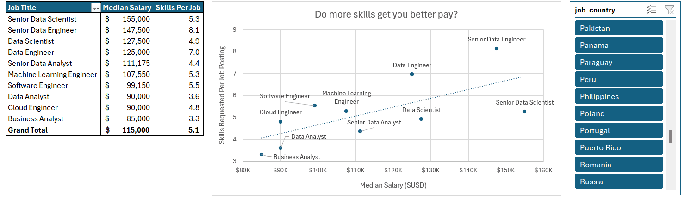
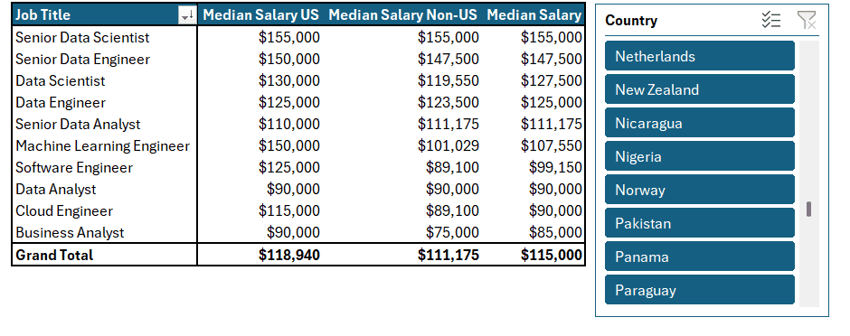
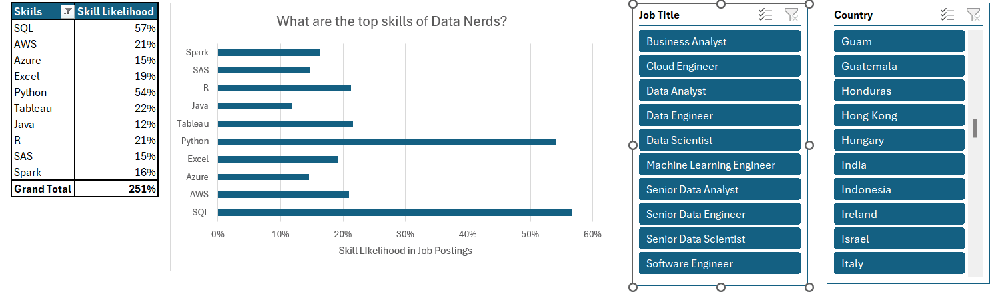
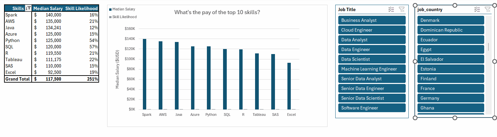
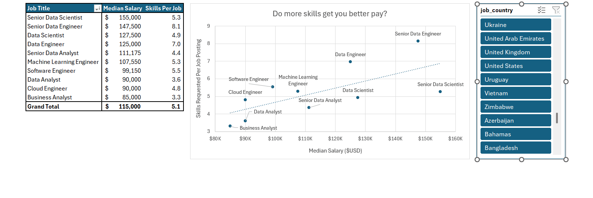

# Data Science Industry's Salary & Skills Analysis

## Project Overview
The **Data Science Salary & Skills Analysis** provides a comprehensive examination of compensation patterns and technical skill requirements across key data-focused roles in the industry. This analytical project enables professionals to understand the relationship between salary levels, job titles, and required technical competencies.

The analysis leverages structured data to uncover insights into how specific skills impact earning potential and which technical proficiencies are most valued across different data roles.

## Key Features
- **Salary vs Skills Correlation**: Analytical view connecting median salary levels with the number of skills required for each job role
- **Regional Salary Comparison**: Breakdown of compensation differences between US and non-US markets for data professionals
- **Skill Demand Analysis**: Identification of most frequently required technical skills in data science job market
- **Skill Value Assessment**: Analysis of how specific technical skills correlate with higher compensation levels

## Dataset Structure

| Sheet Name | Description |
|------------|-------------|
| **Salary vs Skills** | Core analysis linking job titles with median salaries and average skills required |
| **Salary Analysis** | Comparative view of US vs non-US salary distributions across roles |
| **Skill Job Analysis** | Frequency analysis of technical skills in job requirements |
| **Skill Salary Analysis** | Correlation between specific skills and median salary levels |

## Key Metrics and Columns
- **Job Title**: Professional roles including **Senior Data Scientist, Data Engineer, ML Engineer, Business Analyst**
- **Median Salary**: Compensation benchmarks across different roles and regions
- **Skills Per Job**: Average number of technical skills required per position
- **Skill Likelihood**: Probability of each skill appearing in job requirements
- **Regional Breakdown**: US vs non-US salary comparisons

## Key Findings

### Salary Trends
- **Senior Data Scientists** command the highest median salary at $155,000
- **Senior Data Engineers** follow closely at $147,500
- Entry-level **Data Analysts** and **Business Analysts** start around $85,000-$90,000
- US salaries generally exceed non-US counterparts, particularly for **Machine Learning Engineers** ($150,000 vs $101,029)

### Skills Analysis
- **SQL** and **Python** are the most frequently required skills (56.6% and 54.1% likelihood respectively)
- **Spark** correlates with the highest median salary ($140,000) despite moderate demand
- **AWS** skills command $135,000 median salary with 20.9% occurrence rate
- Senior roles require significantly more skills (8.14 for Senior Data Engineers vs 3.60 for Data Analysts)

### Skill Value Proposition
- Specialized skills like **Spark, AWS, and Java** correlate with higher compensation
- Visualization tools (**Tableau, Excel**) and statistical languages (**R, SAS**) show moderate salary impact
- The most common skills (**Python, SQL**) provide solid baseline compensation but require specialization for premium earnings

## Technologies Used
- **Microsoft Excel** (Data Analysis, Formulas, Comparative Analysis)
- **Statistical Correlation Methods**
- **Market Compensation Analysis Techniques**

---

## **Usage**
1. Download or clone this repository:
   ```bas
   https://github.com/Minhajulhoque/Project_2_Analysis.git
3. Navigate to the **Salary Calculator** sheet to interact with dropdowns and visual dashboards.  
4. Use filters by *country*, *title*, or *employment type* to view targeted insights.  
5. Optionally, explore the **Data** sheet for raw job listings and analytical experimentation.

---

## Professional Applications
- **Job Seekers**: Identify high-value skills and realistic salary expectations
- **Hiring Managers**: Benchmark compensation packages against market rates
- **Career Planners**: Understand skill development pathways for career advancement
- **Educators**: Align curriculum with industry demands and valued competencies

---

## Future Enhancements
- Integration with real-time job market data feeds
- Expanded regional breakdowns (Europe, Asia-Pacific, etc.)
- Skill combination analysis for optimal career pathways
- Industry-specific compensation variations (tech, finance, healthcare)

---

## **License**
This project is released under the **MIT License**, permitting open usage, adaptation, and educational distribution.

---

## **Data source**
The Dataset and project are part of educational Excel course from Luke Barousse on [Youtube](https://www.youtube.com/watch?v=pCJ15nGFgVg&t=19840s). I really appriciate his work and the way he helps people on their proffecional way!

---
